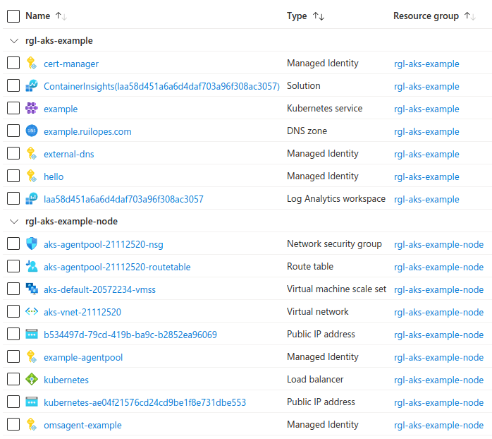

an example azure kubernetes cluster using aks

This will use [terraform](https://www.terraform.io/) to:

* Create an [Azure Kubernetes Service (AKS)](https://learn.microsoft.com/en-us/azure/aks/) Kubernetes instance.
* Create a public [Azure DNS Zone](https://learn.microsoft.com/en-us/azure/dns/dns-overview).
* Use [Traefik](https://traefik.io/) as the Ingress Controller.
* Use [external-dns](https://github.com/kubernetes-sigs/external-dns) to create the Ingress DNS Resource Records in the Azure DNS Zone.
* Use [cert-manager](https://github.com/cert-manager/cert-manager) to create [Let's Encrypt](https://letsencrypt.org/) issued certificates using the [ACME DNS-01 challenge](https://letsencrypt.org/docs/challenge-types/#dns-01-challenge).

# Usage (on a Ubuntu Desktop or builder environment)

Install the tools (or launch and enter the builder environment):

```bash
# install the tools.
./provision-tools.sh
# OR launch the builder environment and use the tools inside it.
# NB you must install the ubuntu 22.04 vagrant base box from:
#     https://github.com/rgl/ubuntu-vagrant
time vagrant up builder
vagrant ssh
cd /vagrant
```

Login into azure-cli:

```bash
az login
```

List the subscriptions and select the current one if the default is not OK:

```bash
az account list
az account set --subscription=<id>
az account show
```

Review `main.tf`, especially, the variables:

* `dns_zone`
* `letsencrypt_email`
* `letsencrypt_server`

Initialize terraform:

```bash
make terraform-init
```

Launch the example:

```bash
# NB you have to be aware of the Let's Encrypt rate limits.
#    see https://letsencrypt.org/docs/duplicate-certificate-limit/
make terraform-apply
```

These are the resources that should have been created:



Show the DNS Zone nameservers:

```bash
terraform output -json dns_zone_name_servers
```

Using your parent domain DNS Registrar or DNS Hosting provider, delegate the
`dns_zone` DNS Zone to the returned `dns_zone_name_servers` nameservers. For
example, at the parent domain DNS Zone, add:

```plain
example NS ns1-01.azure-dns.com.
example NS ns2-01.azure-dns.net.
example NS ns3-01.azure-dns.org.
example NS ns4-01.azure-dns.info.
```

Verify the delegation:

```bash
dns_zone="$(terraform output -raw dns_zone)"
dns_zone_name_server="$(terraform output -json dns_zone_name_servers | jq -r '.[0]')"
dig ns $dns_zone "@$dns_zone_name_server"
```

See some information about the cluster:

```bash
export KUBECONFIG=$PWD/shared/kube.conf
kubectl cluster-info
kubectl get nodes -o wide
kubectl get pods -o wide --all-namespaces
kubectl get pvc --all-namespaces
kubectl get storageclass
```

Deploy the example `hello` workload:

```bash
./hello/deploy.sh
```

Test the `hello` endpoint TLS at:

  https://www.ssllabs.com/ssltest/

Test the `hello` endpoint HTTP to HTTPS redirect:

```bash
hello_ingress="$(kubectl get ingress hello -o json)"
hello_host="$(jq -r '.spec.rules[0].host' <<<"$hello_ingress")"
wget "http://$hello_host"
```

When you are done with the `hello` example, destroy it:

```bash
./hello/destroy.sh
```

And destroy everything:

```bash
make terraform-destroy
```

## Kubernetes Dashboard

Launch the kubernetes API server proxy in background:

```bash
export KUBECONFIG=$PWD/shared/kube.conf
kubectl proxy &
```

Create the admin user and save its token:

```bash
# create the admin user for use in the kubernetes-dashboard.
# see https://github.com/kubernetes/dashboard/blob/master/docs/user/access-control/creating-sample-user.md
# see https://github.com/kubernetes/dashboard/blob/master/docs/user/access-control/README.md
# see https://kubernetes.io/docs/concepts/configuration/secret/#service-account-token-secrets
kubectl apply -n kube-system -f - <<'EOF'
---
apiVersion: v1
kind: ServiceAccount
metadata:
  name: admin
---
apiVersion: v1
kind: Secret
type: kubernetes.io/service-account-token
metadata:
  name: admin
  annotations:
    kubernetes.io/service-account.name: admin
---
apiVersion: rbac.authorization.k8s.io/v1
kind: ClusterRoleBinding
metadata:
  name: admin
roleRef:
  apiGroup: rbac.authorization.k8s.io
  kind: ClusterRole
  name: cluster-admin
subjects:
  - kind: ServiceAccount
    name: admin
    namespace: kube-system
EOF
# save the admin token.
install -m 600 /dev/null shared/kube-admin-token.txt
kubectl -n kube-system get secret admin -o json \
  | jq -r .data.token \
  | base64 --decode \
  >shared/kube-admin-token.txt
```

Then access the kubernetes dashboard at:

  http://localhost:8001/api/v1/namespaces/kube-system/services/https:kubernetes-dashboard:https/proxy/

Then select `Token` and use the contents of `shared/kube-admin-token.txt` as the token.

Alternatively you could [assign the cluster-admin role to the kubernetes-dashboard service account](https://docs.microsoft.com/en-us/azure/aks/kubernetes-dashboard), but by creating an account for you, you only grant it that access when you are using the dashboard.

# Reference

* https://learn.microsoft.com/en-us/azure/aks/
* https://learn.microsoft.com/en-us/azure/developer/terraform/create-k8s-cluster-with-tf-and-aks
* https://azure.microsoft.com/en-us/pricing/details/monitor/
* https://github.com/terraform-providers/terraform-provider-azurerm/tree/master/examples/kubernetes
* https://learn.microsoft.com/en-us/azure/aks/load-balancer-standard
* https://learn.microsoft.com/en-us/azure/aks/internal-lb
